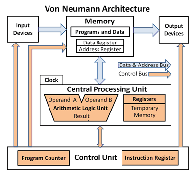
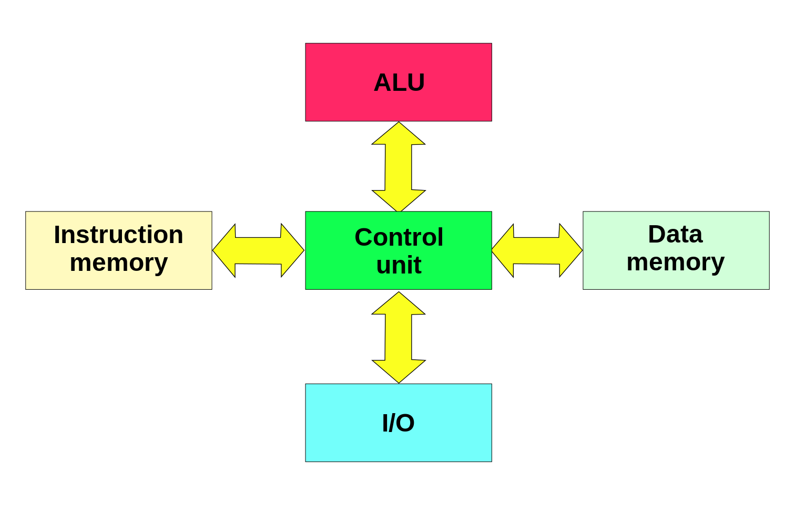
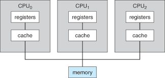

# Computer Architecture
___
## Logic Model

<table>
    <tr>
        <td width=150 height=40 bgcolor=#eeeeee align=center>Background</td>
        <td colspan=3 width=450 bgcolor=#eeeeee>The chips built in the previous projects.
        The machine language syntax. The von Neumann architecture and relevant instructions. 
        </td>
    </tr>
    <tr>
        <td width=150 height=40 bgcolor=#eeeeee align=center>Goal</td>
        <td colspan=3 width=450 bgcolor=#eeeeee>Learn about the von Neumann architecture.Use the chips
        built previously to make a general Hack computer. Understand the working of hardware.
        Prepare for the assembler’s implementation.
        </td>
    </tr>
    <tr>
        <td width=150 height=40 bgcolor=#eeeeee align=center>Effect</td>
        <td width=150 bgcolor=#eeeeee align=center>Output</td>
        <td width=150 bgcolor=#eeeeee align=center>Activities</td>
        <td width=150 bgcolor=#eeeeee align=center>Input</td>
    </tr>
    <tr>
        <td width=150 height=180 bgcolor=#eeeeee valign=top>Understanding the generality of Von Neumann architecture. 
        The programs’ working supports the practicability
        of von Neumann architecture and the completeness of Turing machine. 
        </td>
        <td width=150 bgcolor=#eeeeee valign=top>Memory.hdl 
        CPU.hdl 
        Computer.hdl 
        Test programs’ working.
        </td>
        <td width=150 bgcolor=#eeeeee valign=top>Use the HDL to modify the hardware and by analyzing the instructions of
        machine language, combine the right chips to achieve the function of each part. 
        Realize the information’s transportation in different part of the von Neumann architecture, and coordinate memory and CPU smoothly.
        </td>
        <td width=150 bgcolor=#eeeeee valign=top> Content: PC, RAM4K, RAM16K, ALU, Screen, Keyboard and all the other chips built before. 
        Studying Material: Nand2T course, the element of computing system. 
        Tools: HDL and hardware simulator.
        </td>
    </tr>
</table>

___
### 1. Background
In the previous chapters, we have learned about combinational logic and sequential logic, and also had a taste of the Hack machine language.
So, how could we use these discrete parts of knowledge to build a powerful computer?

Of course we should firstly know the relationship among each parts and then we can build the whole structure of our computer step by step.
 And this structure largely determines the computer's functions and performance in some way. **This structure is called computer architecture.**
 
The first documented computer architecture was in the correspondence between Charles Babbage and Ada Lovelace, describing the analytical engine.
 And in mordern computer science, the most well-known architecture is **Von Neumann architecture**, which is exactly what we are going to build in this chapter.
 
After that, the hardware of our Hack computer is done and we are going to software part. So in some way, the computer architecture is also a bridge between
hardware and software. The upper level software will finally use the machine language instructions to coordinate the machine, and this process is just determined by
the computer architecture.

Besides Von Neumann architecture, of course there are other computer architectures. **What are the connections among them?** And **what are the differences?** These questions 
are also what we are going to discuss.

___
### 2.1 Von Neumann architecture

It is quite clear that we must build our computer in Von Neumann architecture. But before that, there is a question -- **why Von Neumann?**

In other words, **what is the specifications of Von Neumann architecture?**

>The von Neumann architecture, which is also known as the von Neumann model and Princeton architecture, is a computer architecture based on the 1945 description by the mathematician and physicist John von Neumann
and others in the First Draft of a Report on the EDVAC.
This describes a design architecture for an electronic digital computer with parts consisting of a **processing unit** containing an arithmetic logic unit and processor registers;
a **control unit** containing an instruction register and program counter; a **memory** to store both data and instructions; **external mass storage**; and input and output mechanisms.
The meaning has evolved to be **any stored-program computer in which an instruction fetch and a data operation cannot occur at the same time because they share a common bus**.
This is referred to as the von Neumann bottleneck and often limits the performance of the system. (Wikipedia)

From the descriptions in _Wikipedia_ we can get such points:

* It has some basic parts like CPU, CU, memory, mass storage and I/O devices.
* An instruction fetch and a data operation cannot occur at the same time.
* Its performance is limited, but it is simpler compared with other architectures.

So that is what we should know about Von Neumann architecture -- **a standard and ralatively simple stored program computer architecture which has its bottleneck in performance**.
___
### 2.2 Von Neumann bottleneck
As is mentioned above, there exists what is called Von Neumann bottleneck in Von Neumann architecture.
Then you come to wonder how could it happen. So here is the detailed explanation to Von Neumann bottleneck.

In Von Neumanm architecture, there is **only one shared bus between the program memory and data memory**.
Such design leads to the von Neumann bottleneck -- 
the limited throughput (data transfer rate) between the central processing unit (CPU) and memory
compared to the amount of memory. Because the single bus can only access one of the two classes
of memory at a time, throughput is lower than the rate at which the CPU can work.
This seriously limits the effective processing speed when the CPU is required to perform minimal
processing on large amounts of data. The CPU is continually forced to wait for needed data to be
transferred to or from memory. Since CPU speed and memory size have increased much faster than the
throughput between them, the bottleneck has become more of a problem, a problem whose severity
increases with every newer generation of CPU.

That is the answer.

So here you come to wonder -- **what can be done to avoid such bottleneck?** 

And that is the story of the other computer architectures. A relatively more advanced architecture called Harvard
just solve this problem.
___
### 3. Harvard architecture

As is explained above, the Von Neumann bottleneck is the consequence of the shared bus, so the most direct way
to solve it is just adding another bus. And by this means, we have Harvard architecture.

>In a system with a pure von Neumann architecture, instructions and data are stored in the same memory,
so instructions are fetched over the same data path used to fetch data. This means that a CPU cannot simultaneously
read an instruction and read or write data from or to the memory. In a computer using the Harvard architecture,
the CPU can both read an instruction and perform a data memory access at the same time, even without a cache.
A Harvard architecture computer can thus be faster for a given circuit complexity because instruction fetches
and data access do not contend for a single memory pathway. (Wikipedia)

Also, a Harvard architecture machine has **distinct code and data address spaces**:
instruction address zero is not the same as data address zero. Instruction address zero might identify a
twenty-four bit value, while data address zero might indicate an eight-bit byte that is not part of that
twenty-four bit value.

___

### 4. Some other advanced architectures
As we all know, electric pulses travel through a wire no faster than the speed of light. Since light travels
approximately 1 foot in a nanosecond (one billionth of a second), it requires at least 2 nonseconds for the 
control unit in the CPU to fetch an instructions from a memeory cell that is 1 foot away. Consequently, to fetch
and execute an instruction in such a machine requires several nanoseconds -- which means that increasing speed of a
machine ultimately becomes a miniaturization pronlem. Although fantastic advances have been made in this area,
there appears to be a **limit**.

In an effort to solve this dilemma, computer science concentrates on **throughput** rather than merely execution
speed. And thoughput here refers to the total amount of work the machine can accomplish in a given amount of
time rather than how it takes to do one task.

And some other advanced architectures based on this concept have been invented.

>#### Pipelining
In computing, a pipeline, also known as a data pipeline, is a set of data processing elements connected in series,
where the output of one element is the input of the next one. The elements of a pipeline are often executed in
parallel or in time-sliced fashion. Some amount of buffer storage is often inserted between elements. (Wikipedia)

>#### Multiprocessing
Multiprocessing is the use of two or more central processing units (CPUs) within a single computer system.  

In conclusion, all these architectures are different steps towards **parallel processing**, which is the performance
of several activities at the same time.

___

### 5. Significance
In this chapter, we learned how to build a general-purpose Hack computer, which is in Von Neumann architecture.
Actually, in the process we can found that any computers' functions, specifications and performance were directly
revelent to the design of computer architectures. In a word, **computer architecture is the skeleton of the hardware
part of computers**. Only with the well constructed computer architecture can the soul of the software part fully perform
its functions.

After this chapter, we will go into the software part. And the next chapter is about assembly language, which is
highly revelent to the structure of our computer architecture -- Von Neumann architecture. If you have problems
in understanding the Hack assembly language, you may as well go back here to have a look again.

___